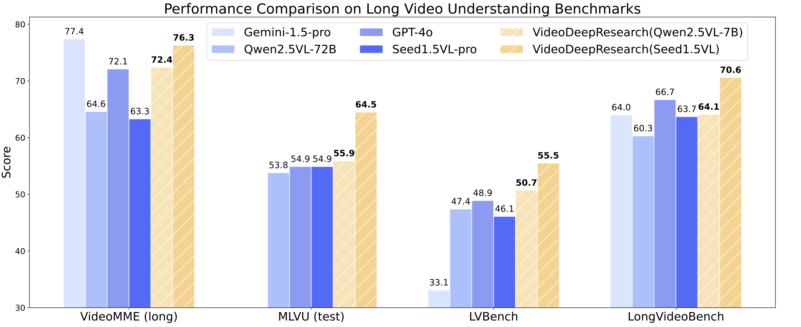

# 🎬 Video DeepResearch 
In this work, we challenge this common belief by introducing **VideoDeepResearch**, a novel agentic framework for long video understanding. Our approach relies solely on a text-only large reasoning model (LRM) combined with a modular multi-modal toolkit, including multimodal retrievers and visual perceivers, all of which are readily available in practice. Our results demonstrate that VideoDeepResearch achieves substantial improvements over existing MLLM baselines, surpassing the previous state-of-the-art by 9.6\%, 6.6\%, and 3.9\% on MLVU (test), LVBench, and LongVideoBench, respectively. These findings highlight the promise of agentic systems in overcoming key challenges in LVU problems. 


<p align="center">
  
</p>


## 🎬 Demo

<div align="center">
    <video src="https://github.com/user-attachments/assets/6f90154b-1ab4-4df3-ac02-1deb26d702f1"/>
</div>


---

## ✨ Key Features

* 📹 **Diverse Long-Video Understanding**

  * Single-detail, multi-detail, and multi-hop question answering across various scenes
* 🛠️ **Multi-Tool Integration**

  * Visual Perceiver, Video Browser, Text/Subtitle/Image Retriever & Extractor
* 🔄 **Dynamic Multi-Round Calls**

  * Automated tool-call scheduling based on question complexity
* 🔍 **Full Interpretability**

  * Detailed trace logs and step-by-step reasoning

---

## 🚀 Quick Start

### 1. Clone & Install

```bash
# Clone repository
git clone https://github.com/yhy-2000/VideoDeepResearch.git
cd VideoDeepResearch

# Install dependencies
pip install -r requirements.txt
```

### 2. Project Layout

```
VideoDeepResearch/
├── streamlit_demo_vlm_local.py   # Streamlit demo script that use local vllm server as visual module
├── streamlit_demo_vlm_api.py     # Streamlit demo script that use proprietary API as visual module
├── requirements.txt              # Python dependencies
├── eval/                         # Code for evaluating benchmarks
├── asset/                        # Assets used in the demo
├── data/
│   ├── videos/                   # Raw video files
│   ├── clips/                    # Generated video clips
│   ├── dense_frames/             # Extracted key frames
│   └── subtitles/                # Subtitle files(optional)
└── README.md                     # This documentation
```

### ▶️ Launch Demo

Set the following environment variables of text-only large reasoning model(example for `deepseek-reasoner`):

```bash
export API_MODEL_NAME=deepseek-r1-250120
export API_BASE_URL=https://ark.cn-beijing.volces.com/api/v3
export API_KEY=YOUR_API_KEY
```


> 💡 *Tip: We recomment to use volcengine(https://www.volcengine.com/product/ark) for faster and more stable responses.*


* For **Visual Perceiver & Video Browser**:

  * **Local Server**: run `bash init_vllm_server.sh` then:
    ```bash
      streamlit run streamlit_demo_vlm_local.py
    ```
  * **Proprietary API**: set the enviroment variable `API_MODEL_NAME_VLM`, `API_BASE_URL_VLM`, and `API_KEY_VLM`, e.g.:
    ```bash
      export API_MODEL_NAME_VLM=doubao-1.5-vision-pro-250328
      export API_BASE_URL_VLM=https://ark.cn-beijing.volces.com/api/v3
      export API_KEY_VLM=YOUR_API_KEY
    ```
    then:

    ```bash
      streamlit run streamlit_demo_vlm_api.py
    ```


* After that, you should see in terminal like:

```bash
  Local URL:    http://localhost:8501
  Network URL:  http://192.168.x.x:8501
  External URL: http://your_public_ip:8501
```

Open **Local URL** in your browser to start.


## Results Replication
The examples we provide are sourced from the LVBench and MLVU test sets. To run these examples, please download the corresponding datasets and replace the video_path with the appropriate local path.

We also provide the prompts used in prompt_qwen25vl.py and prompt_seed15vl.py, allowing you to replicate our results using the corresponding configurations.

---

## 🧰 Usage Instructions

1. **Open Browser**: Navigate to `http://localhost:8501`.
2. **Configure Settings**:

   * Choose model and API parameters in the sidebar.
   * Upload or select a video file (`.mp4`) and (optionally) a subtitle file (`.srt`).
3. **Ask Questions**:

   * Type your question regarding the video content.
   * Click **Start Processing**.
4. **Review Results**:

   * View tool-call logs, extracted frames/clips, and final answers below the video player.

> 💡 *Tip: For faster responses, try faster reasoning model apis like `gemini-2.5`.*

---

## 📬 Contact

Encounter issues or have questions? Reach out to:

> **H.Y. Yuan**
> Email: [hyyuan@ruc.edu.cn](mailto:hyyuan@ruc.edu.cn)

## 📄 Citation

If you find this work helpful, please cite our paper:
```bibtex
@misc{yuan2025videodeepresearchlongvideounderstanding,
      title={VideoDeepResearch: Long Video Understanding With Agentic Tool Using}, 
      author={Huaying Yuan and Zheng Liu and Junjie Zhou and Ji-Rong Wen and Zhicheng Dou},
      year={2025},
      eprint={2506.10821},
      archivePrefix={arXiv},
      primaryClass={cs.CV},
      url={https://arxiv.org/abs/2506.10821}, 
}
```
